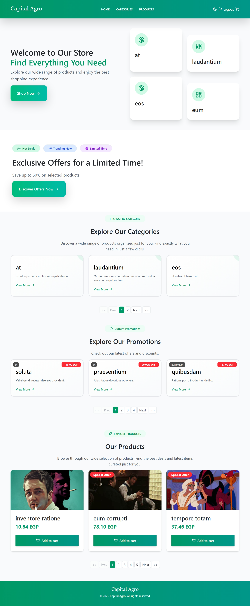
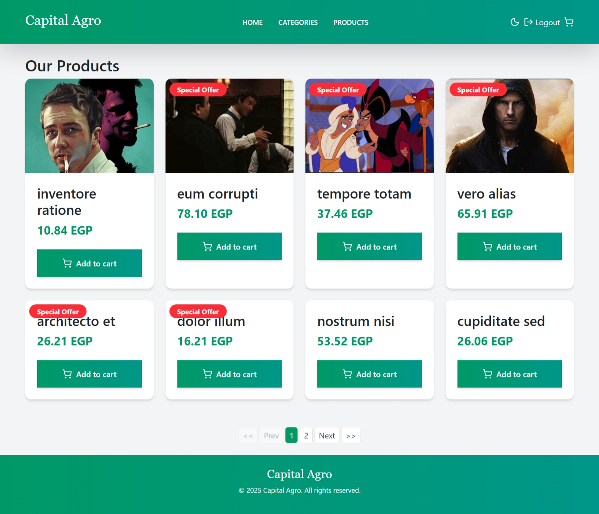
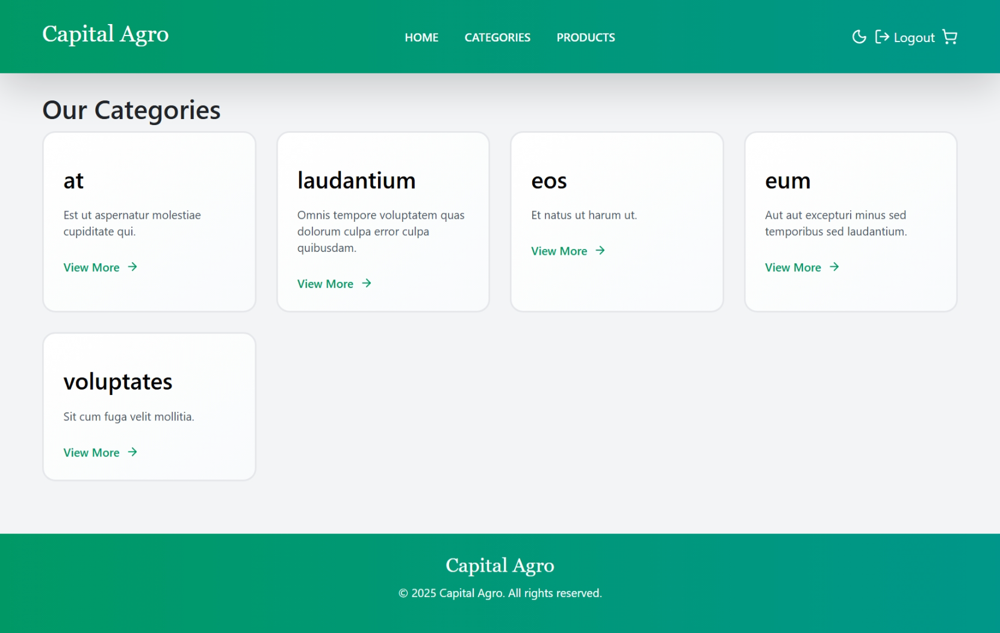
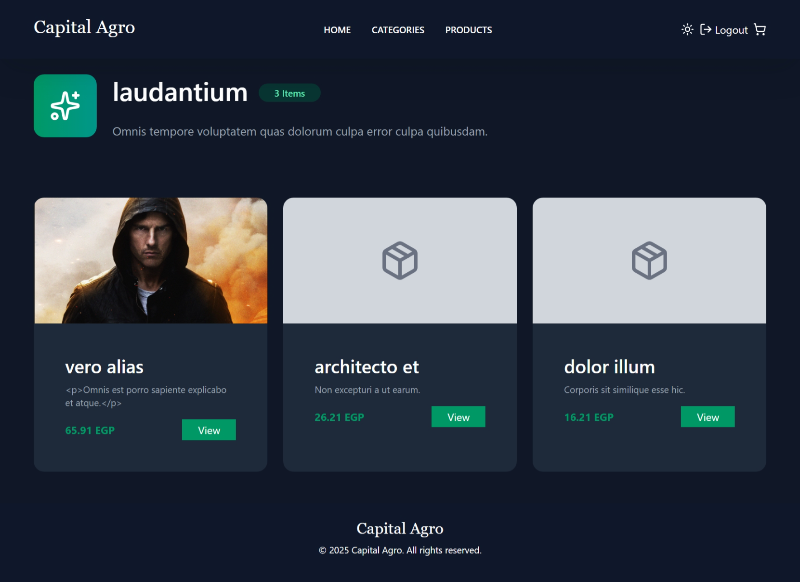

# CapitalAgroWebsite

Modern, Vite-powered React frontend for the Capital Agro storefront.

This repository contains the client-side application built with React + Vite. The UI consumes an external REST API (not included here) and provides product listings, category browsing, product detail pages, a shopping cart UI, and promotional sections.

--

**Project Status:** Frontend scaffold ready for development. Configure and run your backend API separately and set the required environment variables.

**Repository layout (important paths):**

- `src/` — React source (components, pages, contexts, hooks, `api/`)
- `src/api/axiosClient.jsx` — Axios instance (uses `VITE_API_URL`)
- `public/` — static assets (images, favicon)
- `package.json` — scripts & dependencies

--

**Quick Links**

- Dev server: `npm run dev`
- Build: `npm run build`
- Preview production build: `npm run preview`

--

## Project Overview

CapitalAgroWebsite is a React frontend that presents products and categories fetched from an API. It focuses on a clean product browsing experience with pagination, product detail views, promotional sections, and a cart UI.

## Features

- Product listing with pagination
- Product detail pages (includes promotions)
- Category listing and category detail pages (category products)
- Homepage sections for hero, promotions, and featured products
- Cart UI (client-side) with quantity updates and totals
- Light / dark theme support via `ThemeContext`
- Reusable UI components (cards, grids, loaders, pagination)

## Technologies Used

- React 19 + JSX
- Vite (dev server & build)
- Axios (HTTP client)
- react-router-dom (routing)
- Bootstrap + custom Tailwind/utility classes
- Zustand & Redux Toolkit present in `package.json` (optional state management)
- Recharts (charts), SweetAlert2 (alerts), Quill (rich text)

## Important implementation notes

- Axios base URL is configured in `src/api/axiosClient.jsx` using `import.meta.env.VITE_API_URL` and expects the API to expose an `/api` prefix (e.g. `https://api.example.com/api`).
- Several components (products, categories, cart) read `VITE_API_URL` directly for image URLs and links.

--

## Frontend — Installation & Run

Prerequisites: Node.js (16+ recommended), npm.

1. Clone the repo and install dependencies:

```powershell
cd "c:\React Build Projects\CapitalAgroWebsite"
npm install
```

2. Create a `.env` file in the project root (see Environment Variables below).

3. Run development server:

```powershell
npm run dev
```

4. Build production bundle:

```powershell
npm run build
```

5. Preview a production build locally:

```powershell
npm run preview
```

--

## Environment Variables

Create a `.env` file in the frontend root. Vite exposes client-safe variables that must be prefixed with `VITE_`.

At minimum for this frontend:

- `VITE_API_URL` — Base URL of your backend (no trailing `/api`). Example: `https://api.example.com`

Optional / recommended (examples):

- `VITE_GOOGLE_MAPS_KEY` — Maps API key
- `VITE_ANALYTICS_ID` — Analytics identifier

Example `.env`:

```text
VITE_API_URL=https://api.example.com
VITE_GOOGLE_MAPS_KEY=your-google-maps-key
VITE_ANALYTICS_ID=UA-XXXXX-Y
```

Notes:

- `src/api/axiosClient.jsx` builds `baseURL` as `${import.meta.env.VITE_API_URL}/api`.
- All client-side env vars must begin with `VITE_` to be accessible via `import.meta.env` in the browser build.

--

## API Summary (endpoints used by this frontend)

The frontend expects a REST API with these common endpoints (adjust to your backend):

- GET `/api/products` — paginated product list (query params: `page`, `perPage`)
- GET `/api/products/:id` — product details (returns product data and `promotions` array)
- GET `/api/categories` — categories list (paginated)
- GET `/api/categories/:id` — single category including `products`

Where images are stored on your backend, the frontend constructs image URLs using `VITE_API_URL` (e.g. `
${VITE_API_URL}/storage/<image_path>`).

--

# Screenshots

- Example admin views (screenshots taken from the running app and stored in the `docs` folder):










